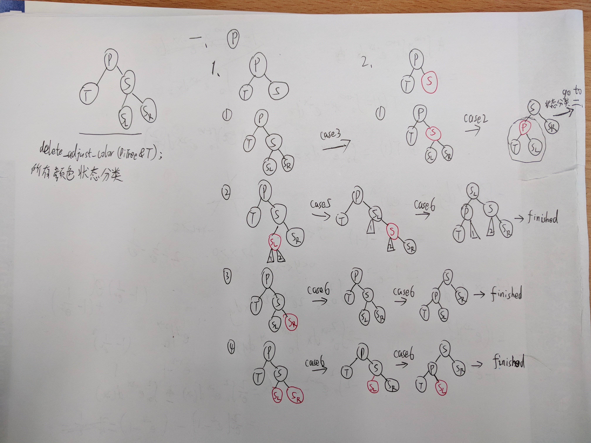
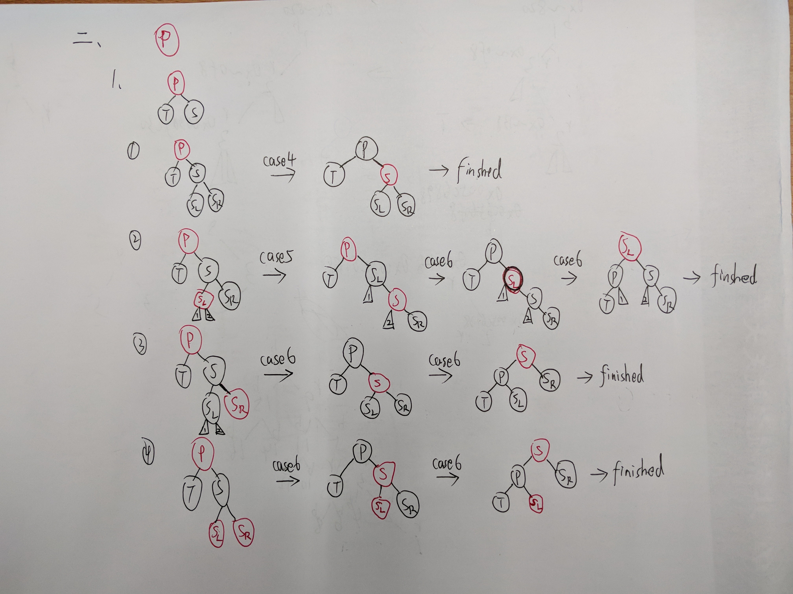

# Algorithm-Learning

## 二叉搜索树（BST）

**参考**：https://zh.wikipedia.org/wiki/%E4%BA%8C%E5%85%83%E6%90%9C%E5%B0%8B%E6%A8%B9

- #### 关键操作

  删除：

  在二叉查找树删去一个结点，分三种情况讨论：

  1. 若*p结点为叶子结点，即PL（左子树）和PR（右子树）均为空树。由于删去叶子结点不破坏整棵树的结构，则只需修改其双亲结点的指针即可。
  2. 若*p结点只有左子树PL或右子树PR，此时只要令PL或PR直接成为其双亲结点*f的左子树（当*p是左子树）或右子树（当*p是右子树）即可，作此修改也不破坏二叉查找树的特性。
  3. 若*p结点的左子树和右子树均不空。*s为*p左子树的最右下的结点，q为s的双亲结点。在删去*p之后，为保持其它元素之间的相对位置不变，做法如下：
     1. 若q != p，用s代替p，q->rchild = s->lchild
     2. 若q == p, 也用s代替p, q->lchild = s->lchild

---

## 平衡二叉搜索树

### AVL树

**参考**：https://zh.wikipedia.org/wiki/AVL%E6%A0%91

AVL树得名于它的发明者[G. M. Adelson-Velsky](https://zh.wikipedia.org/wiki/%E6%A0%BC%E5%A5%A5%E5%B0%94%E5%90%89%C2%B7%E9%98%BF%E6%9D%B0%E5%B0%94%E6%9D%BE-%E9%9F%A6%E5%88%A9%E6%96%AF%E5%9F%BA)和[E. M. Landis](https://zh.wikipedia.org/w/index.php?title=Evgenii_Landis&action=edit&redlink=1)，他们在1962年的论文《An algorithm for the organization of information》中发表了它。

**AVL树**是最先发明的自平衡二叉查找树。在AVL树中任何节点的两个子树的高度最大差别为1，所以它也被称为**高度平衡树**。

- #### 时间复杂度

  > 查找、插入和删除在平均和最坏情况下的时间复杂度都是。

- #### 平衡

  > 增加和删除可能需要通过一次或多次树旋转来重新平衡这个树。

  > 节点的**平衡因子**是它的左子树的高度减去它的右子树的高度（有时相反）。带有平衡因子1、0或 -1的节点被认为是平衡的。带有平衡因子 -2或2的节点被认为是不平衡的，并需要重新平衡这个树。平衡因子可以直接存储在每个节点中，或从可能存储在节点中的子树高度计算出来。

- #### 关键操作

  1. AVL旋转

  1. 单向右旋平衡处理LL：由于在*a的左子树根节点的左子树上插入节点，*a的平衡因子由1增至2，致使以*a为根的子树失去平衡，则需进行一次右旋转操作；
  2. 单向左旋平衡处理RR：由于在*a的右子树根节点的右子树上插入节点，*a的平衡因子由-1变为-2，致使以*a为根的子树失去平衡，则需进行一次左旋转操作；
  3. 双向旋转（先左后右）平衡处理LR：由于在*a的左子树根节点的右子树上插入节点，*a的平衡因子由1增至2，致使以*a为根的子树失去平衡，则需进行两次旋转（先左旋后右旋）操作。
  4. 双向旋转（先右后左）平衡处理RL：由于在*a的右子树根节点的左子树上插入节点，*a的平衡因子由-1变为-2，致使以*a为根的子树失去平衡，则需进行两次旋转（先右旋后左旋）操作。

- ### 实现

  - .png)

  ​	

  - **删除**参照 `DeleteBST(BiTree &T, KeyType key);`

---

### 红黑树

**参考**：https://zh.wikipedia.org/wiki/%E7%BA%A2%E9%BB%91%E6%A0%91

英文：Red–black tree（RBT）

- #### 时间复杂度与空间复杂度

  > 查找、插入和删除在平均和最坏情况下的时间复杂度都是。
  >
  > 红黑树相对于AVL树来说，牺牲了部分平衡性以换取插入/删除操作时少量的旋转操作，整体来说性能要优于AVL树

- #### 性质

  > 红黑树是每个节点都带有*颜色*属性的[二叉查找树](https://zh.wikipedia.org/wiki/%E4%BA%8C%E5%85%83%E6%90%9C%E5%B0%8B%E6%A8%B9)，颜色为*红色*或*黑色*。在二叉查找树强制一般要求以外，对于任何有效的红黑树我们增加了如下的额外要求：
  >
  > 1. 节点是红色或黑色。
  > 2. 根是黑色。
  > 3. 所有叶子都是黑色（叶子是NIL节点，也就是说NIL节点是黑色）。
  > 4. 每个红色节点必须有两个黑色的子节点。（从每个叶子到根的所有路径上不能有两个连续的红色节点。）
  > 5. 从任一节点到其每个叶子的所有[简单路径](https://zh.wikipedia.org/wiki/%E9%81%93%E8%B7%AF_(%E5%9B%BE%E8%AE%BA))都包含相同数目的黑色节点。
  >
  > 下面是一个具体的红黑树的图例：
  >
  >
  >
  > 
  >
  > 这些约束确保了红黑树的关键特性：**从根到叶子的最长的可能路径不多于最短的可能路径的两倍长**。结果是这个树大致上是平衡的。因为操作比如插入、删除和查找某个值的最坏情况时间都要求与树的高度成比例，这个在高度上的理论上限允许红黑树在最坏情况下都是高效的，而不同于普通的[二叉查找树](https://zh.wikipedia.org/wiki/%E4%BA%8C%E5%8F%89%E6%9F%A5%E6%89%BE%E6%A0%91)。
  >
  >

- #### 实现

  - #### 插入

    **关键：**调整颜色及旋转

    函数`void RedBlackTree::insert_adjust_color(BiTree &T)`调整当前插入的结点T的颜色，可能需要旋转（新插入的结点默认颜色为**红色**）

    > #### CASE1:
    >
    > >  T是根结点
    >
    > #### CASE2:
    >
    > > T的父节点为黑，则无需做什么
    >
    > #### CASE3:
    >
    > > T的父节点为红，叔父结点也为红
    >
    > #### CASE4:
    >
    > > 父节点为红，叔父结点为黑或空
    > >
    > > 细分4种情况：
    > >
    > > 1. 左右
    > > 2. 右左
    > > 3. 左左
    > > 4. 右右

    **注意**：旋转时候注意调换颜色以及parent父节点指向

  - #### 删除

    > - 注意删除中引入了非空黑色叶子结点 nil，不存储数据，充当所有原来叶子结点的叶子。这是为了删除操作的实现方便而引入的。
    >
    > - 调用顺序：DeleteRBT_real(T, key); ----> delete_one_child(T); -----> delete_adjust_color(T);
    >
    > - 函数
    >
    >   1. `Status DeleteRBT_real(BiTree &T, KeyType key);`
    >
    >      记待删除结点为 T
    >
    >      删除的时候，把问题转化为删除一个孩子的情况：
    >
    >      - T的右孩子为空
    >      - T的左孩子为空(找T的右子树下的最小值smallest_child和T的值兑换，然后转化成对smallest_child进行删除操作)
    >
    >      若左右孩子都为空，则把其中一个当作孩子
    >
    >   2. `void delete_one_child(BiTree &T);`
    >
    >      只有 T和T->child都是黑色才需进入 delete_adjust_color 调节颜色
    >
    >   3. `void delete_adjust_color(BiTree &T);`
    >
    >      注意：记P->X->T  ==> P->T ，X为上一步中delete_one_child 中要删除的结点，而这里调节的 T 是 X 的孩子
    >
    >      ### 颜色调节分6种情况：
    >
    >      记待调节颜色结点为 T, T的父母为P，T的兄弟为S，S的左孩子为SL，S的右孩子为SR
    >
    >      **下面图中灰色结点表示颜色待定（红色或黑色）**
    >
    >      >  实际上第一次递归进来T的情况只可能是case1或case2或case3, 而case3是需要转化成case2，最终都是在递归后由case2转化为case4或case5或case6（此时新的S（相当于原来的SL或SR）只能为黑色，不可能为红色）
    >
    >      #### case1:
    >
    >      .png)
    >
    >      #### case2:
    >
    >      .png)
    >
    >      #### case3:
    >
    >      .png)
    >
    >      #### case4:
    >
    >      .png)
    >
    >      case4这里就完成调节颜色了
    >
    >      #### case5:
    >
    >      .png)
    >
    >      实际上case5之后是需要紧接着case6的操作才算完成颜色调节
    >
    >      #### case6:
    >
    >      实际上case6又涵盖了一些情况：
    >
    >      1. 紧接着处理case5的情况
    >
    >         .png)
    >
    >      2. T是左子树，S是黑，S->lchild是黑，S->rchild是红  或  T是右子树，S是黑，S->lchild是红，S->rchild是黑
    >
    >         .png)
    >
    >      3. T是左子树，S是黑，S->lchild是红，S->rchild是红  或  T是右子树，S是黑，S->lchild是红，S->rchild是红
    >
    >         .png)
    >
    >
    >
    > 
    >
    > 

